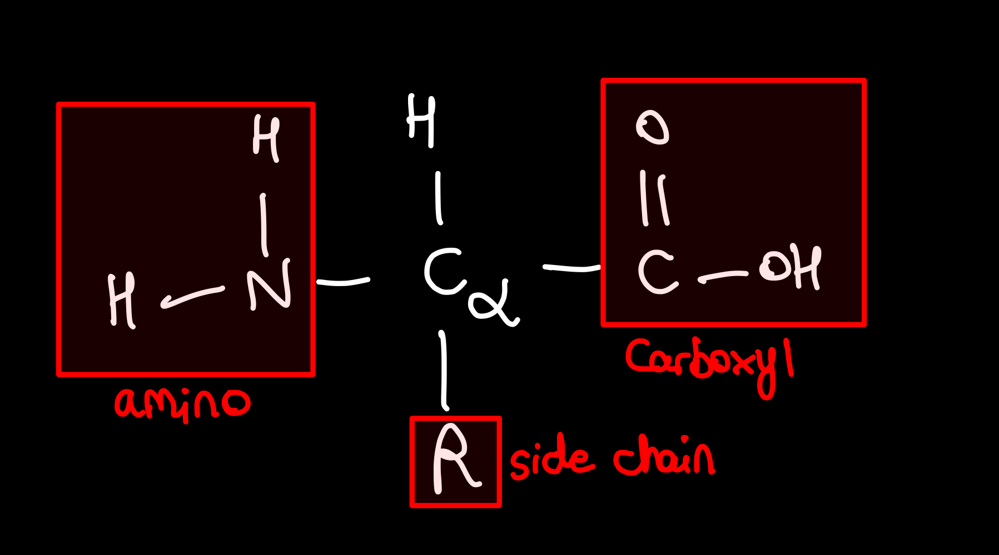
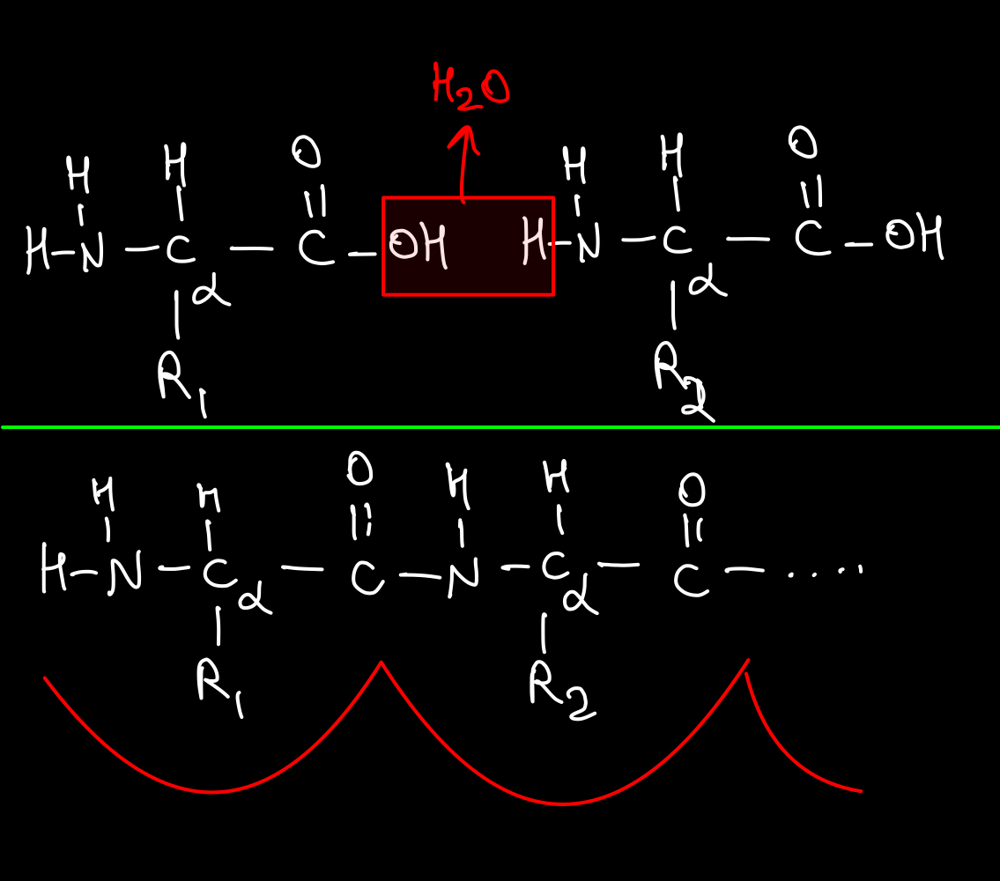
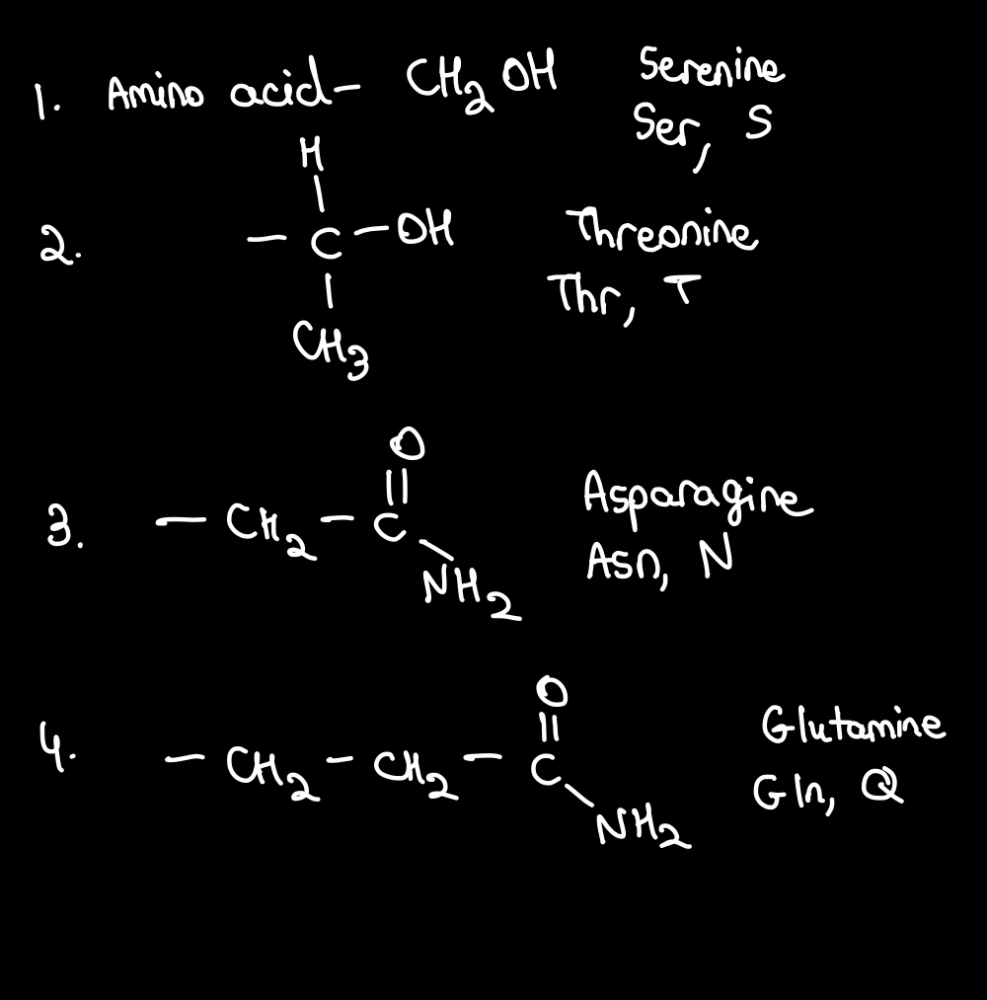
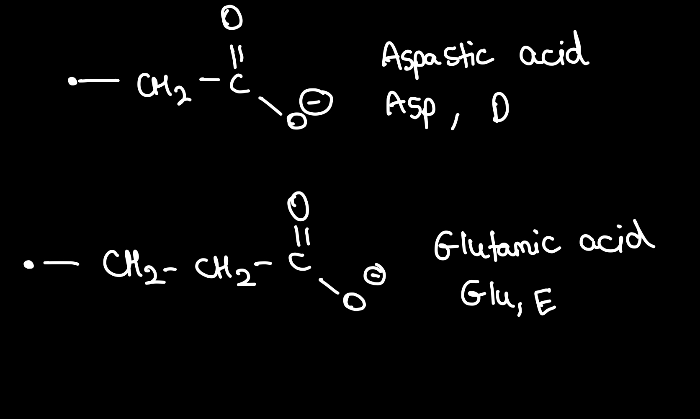
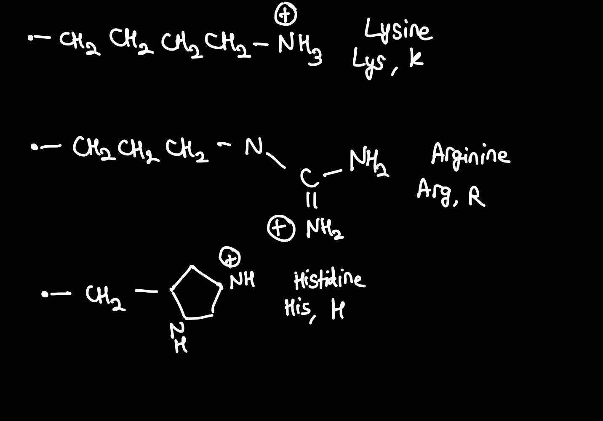
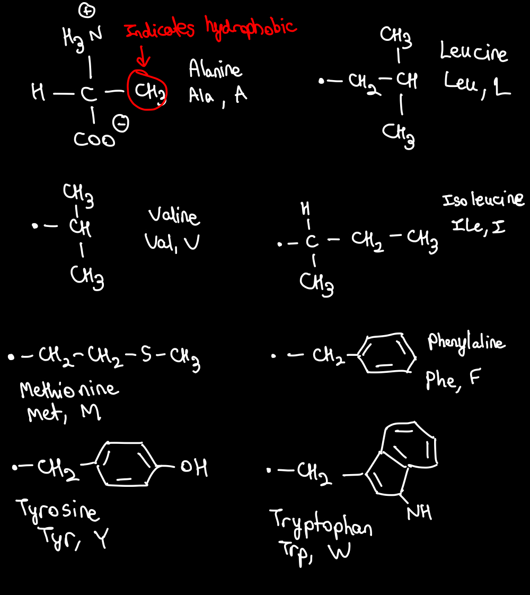
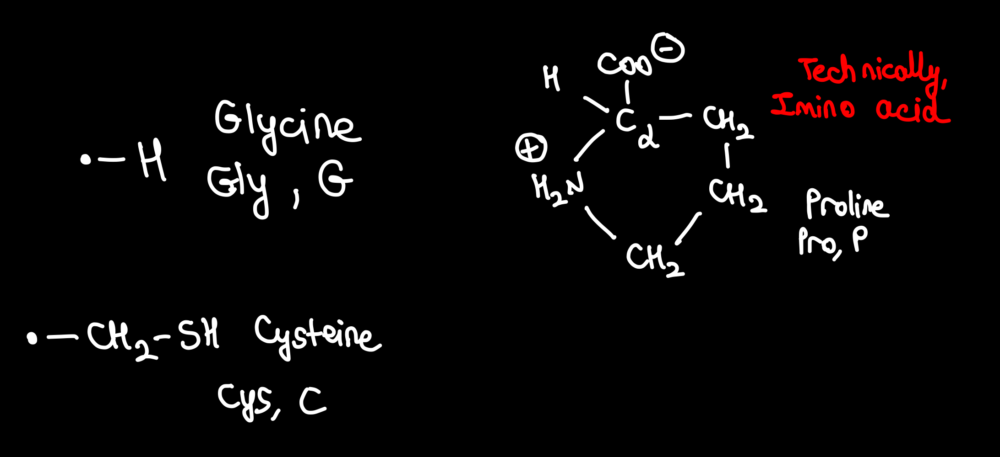

# Proteins

- molecules of major interest in biochemistry

## Primary Structure

**Building Block**: Amino Acid

In the middle you have carbon, called C-alpha. It has 4 bonds. One of the bonds is always Hydrogen. 1 of the bonds is an Amino Group. Another bond is a carboxyl group. The last bond connects to something else.

Now, if we have one more amino acid, we can perform dehydration synthesis. We will take 2 monomers, and connect the 2 monomers by eliminated water.

This would form a peptide bond between the 2 amino acids as shown in the figure above that can keep going on and on

> In the backbone of a protein, adjacent amino acids are held together with covalent bonds.
>
> The primary structure of a protein is the linear arrangement of amino acids.
>
> A peptide bond cannot rotate freely.
>
> Peptide bonds are covalent bonds. As discussed in lecture, single bonds can rotate freely. Double bonds cannot rotate freely. Although the peptide bond is a single bond, it has what the chemists call partial double bond character. That means, the peptide bond really does not rotate very freely.

### 20 Different Side Chains in nature

#### Polar, Uncharged

#### Polar, Charged (-)

#### Polar, Charged (+)

#### Hydrophobic /Non-Polar

#### Special

Since Cysteine has a sulphydryl group, it can form disulphide bonds

## Secondary Structure

$\alpha$ Helix
$\beta$ pleated sheet

- Held in shape by hydrogen bonds, which are formed between the carbonyl O of one amino acid and the amino H of another
- 

## Tertiary Structure

- Overall 3-D structure of the Protein. It's a mixture of $\alpha$ Helix and $\beta$ pleated sheet

> Changing the order of the amino acids will certainly change the overall shape of the protein. In addition, the tertiary structure is disrupted through the breakage of non-covalent bonds. A small increase in temperature can add sufficient energy to disrupt weak forces like van der Waals and some hydrogen bonds, and this can change the overall shape of the protein. A large increase in temperature will cause the protein to denature. Similarly, a change in the pH causes the tertiary structure to destabilize by changing the electrostatic interactions between charged amino acids. Interaction of other molecules often alters the shape of a protein.

## Quartenary Structure

- Has 2 proteins bound to each other via Hydrogen bond or covalent bonds using Cysteine.
- Example, Haemoglobin
