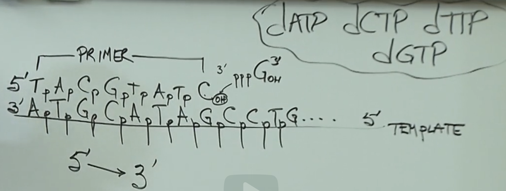
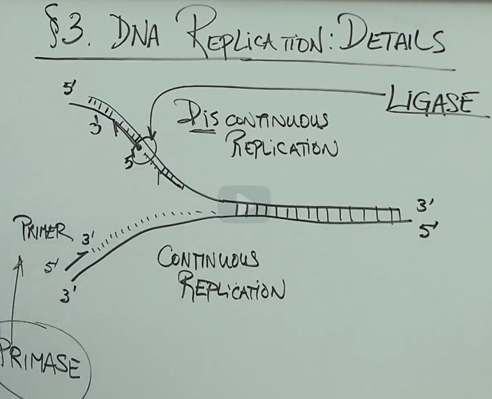

# Details of DNA Replication

- We need a DNA polymarese
- We then grind the bacteria, purify it into all kinds of fractions and test each fraction for the ability to polymarize DNA
- You take DNA, you take nucleotides(deoxyribonucleotides - dATP, dCTP, dGTP, dTTP) to polymerize, and then add different fractions from the cell
- You keep purifying until you find a protein fraction that is able to carry out reactions and polymerize DNA. That is called DNA polymerase
- Every polymerase goes from 5' to 3'
  

**Primase**: In cells, primase creates an RNA primer in the 5’ to 3’ direction. DNA polymerase adds new nucleotides onto this primer.

**Topoisomerase**: Topoisomerase alters the conformation of DNA. During DNA replication, the two strands of DNA become tightly wound around each other ahead of a replication fork, and this creates tension that would eventually halt DNA replication. Topoisomerase prevents this tension from occurring.

**Ligase**: DNA ligase forms a phosphodiester bond between the 3’ OH and the 5’ phosphate of adjacent Okazaki fragments.
