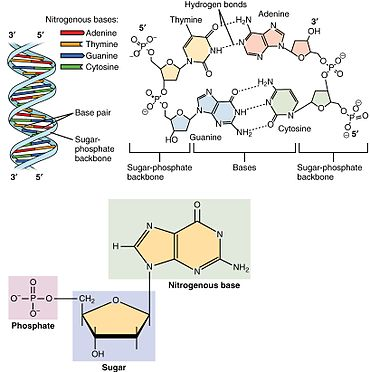
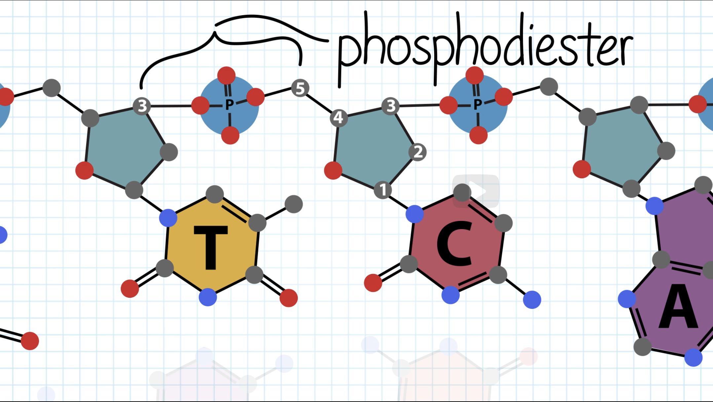
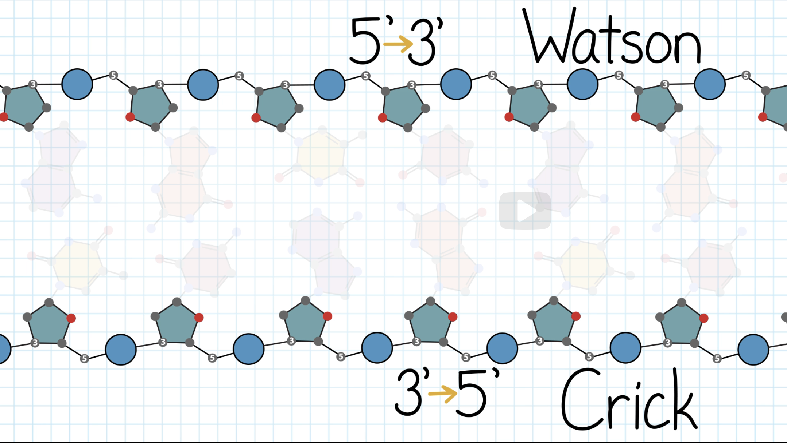
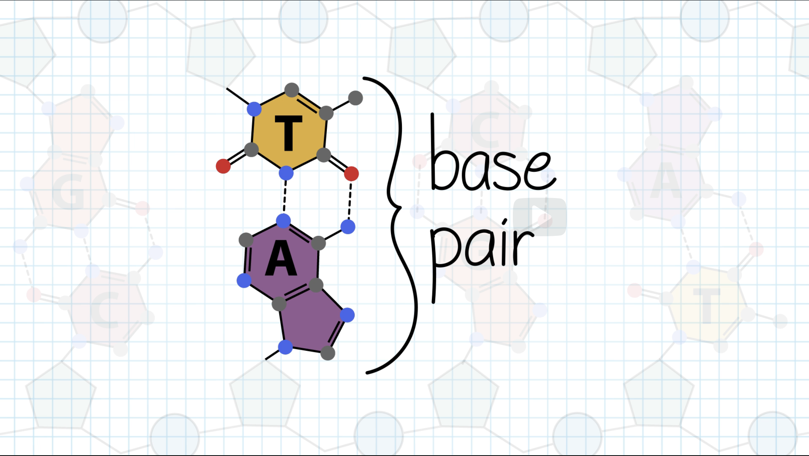
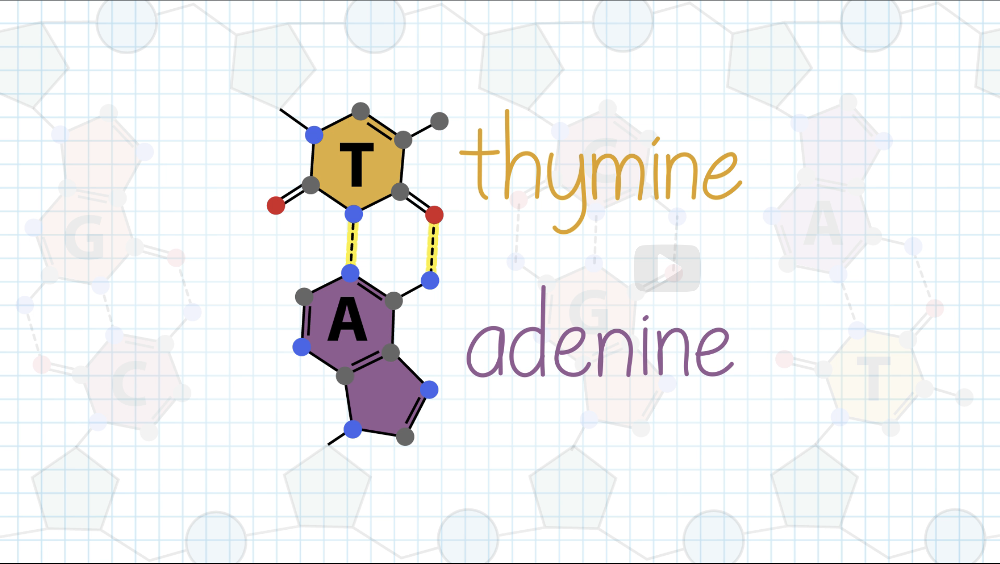
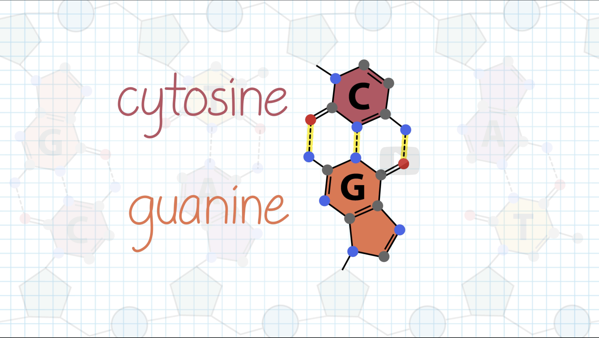
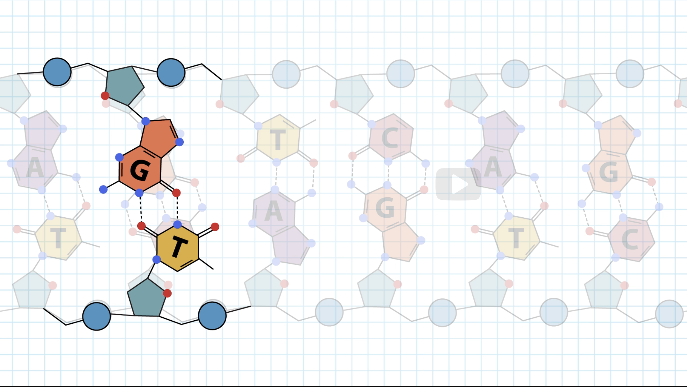

### DNA - Deoxyribonucleic acid

- We commonly find double stranded DNA (dsDNA) in which two strands intertwine to form a double helix, also called a B-Form DNA
- Each strand in the DNA is a polynucleotide meaning the strand is made up of several individual units called nucleotides.
- A nucleotide has 3 components:
  1. 5-carbon sugar
  2. A phosphate group
  3. One of four possible nitrogenous bases:
     1. Adenine (A)
     2. Cytosine (C)
     3. Thymine (T)
     4. Guanine (G)

- Nucleotides attach to each other in the DNA strand by Phosphodiester bonds.
  
  

- Although the nucleotides come together through covalent bonds in the backbone, the two DNA strands interact through non-covalent hydrogen bonds between the bases

- Each base forms multiple hydrogen bonds with it's complementary base on the opposite strand.
- Bound together by Hydrogen bonds, each unit is called a base pair
  
- Thymine preferentially pairs with Adenine through 2 hydrogen bonds and Cytosine preferentially pairs with Guanine through 3 hydrogen bonds
  
  
- Thymine and Cytosine are called Pyrimidines characterized by their single ring structure
- Adenine and guanine are called purines characterized by their double ring structure

- Other base pairs for example G-T do not have the same geometry, cannot form strong hydrogen bonds and disturb the helix
  

- The double helix structure is highly regular. Each turn of the helix measures approximately 10 base pairs
