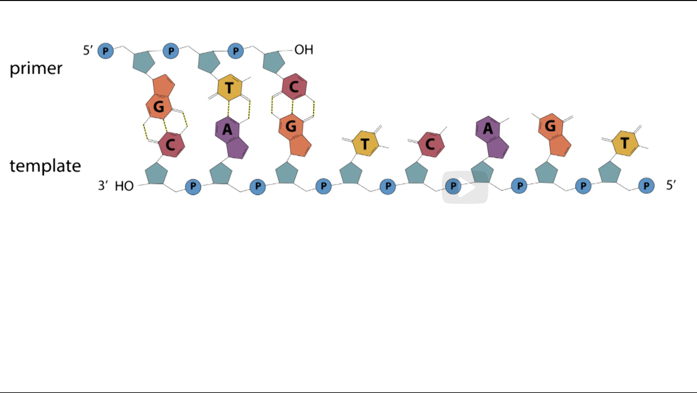
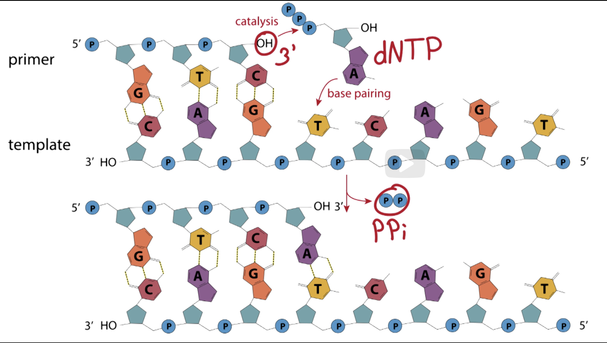
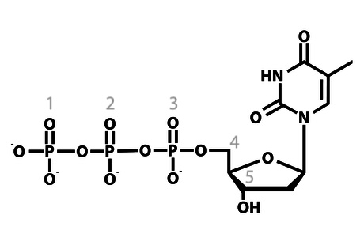

- The Primer has a 3 prime OH Hydroxyl group
- The catalysis works by having the OH attack the alpha phosphate of an incoming deoxynucleotide triphosphate, releasing a pyrophosphate
- This only happens when the base correctly base pairs with the base of the template

Catalyzation is done by an enzyme called `DNA Polymerase`

Primer Template Junction (PTJ):

1. First of all, it requires a 3' OH primer
2. It must be annealed to a longer, single-stranded DNA with the single stranded DNA adjacent to the 3' OH Primer
3. All 4 Deoxynucleotide triphosphates
4. Added dNTP must BP with the template for catalysis
5. 3' OH Primer is always extended by DNA Synthesis

# Question

Using the dropdown options, identify each phosphate group, the specified carbons, and which nucleotide is depicted in the following image.

1. Which number in the structure corresponds to the alpha (α) phosphate?
   **Answer** 3
2. Which number in the structure corresponds to the beta (β) phosphate?
   **Answer** 2
3. Which number in the structure corresponds to the gamma (γ) phosphate?
   **Answer** 1
4. Which number in the structure corresponds to the 3' carbon?
   **Answer** 5
5. Which number in the structure corresponds to the 5' carbon?
   **Answer** 4
6. Which nucleotide is depicted?
   **Answer** dATP

## Explanation

Based on the diagram of an Adenosine Triphosphate.
Also, based on what we learned, 3' carbon points to the OH hydroxyl.

### Deoxycytidine triphosphate (dCTP)

### Deoxyguanosine triphosphate (dGTP)

### Deoxythymidine triphosphate (dTTP)

